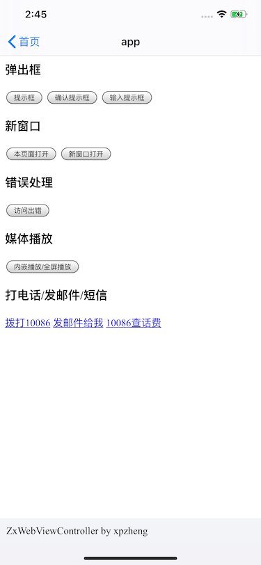
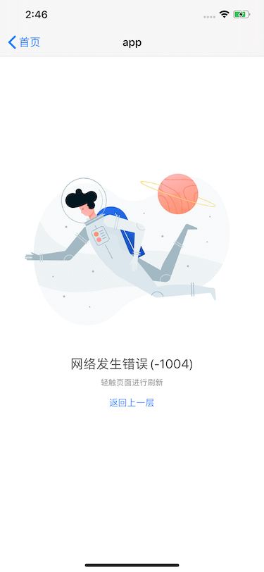
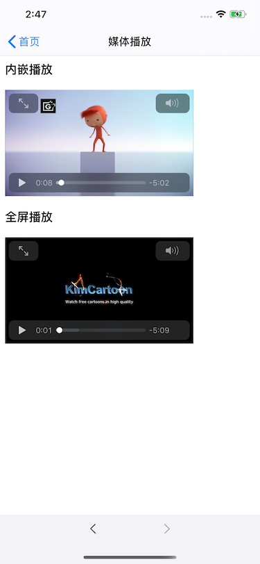
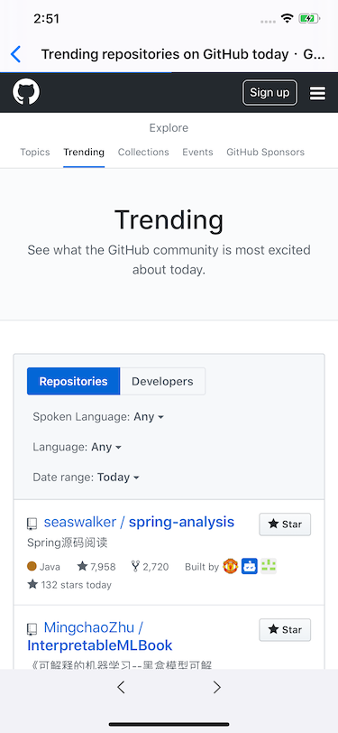

# ZxWebViewController
集成了一些通用功能的WebViewController

功能集合：
- [x] 导航栏自动更新当前网页标题
- [x] 自动同步Cookie（同步请求/异步请求）
- [x] js弹出框的处理（alert/comfirm/prompt）
- [x] 本页面打开与新开页面打开（location.href/window.open()） 
- [x] 顶部加载进度条
- [x] 可设置显示/隐藏进度条
- [x] 加载错误处理（展示错误界面并提供重试手段）
- [x] 仿微信底部导航栏（前进/后退） 
- [x] 可设置展示/隐藏底部导航栏
- [ ] js-native交互桥接与通用接口提供
- [x] 媒体内嵌播放（h5通过playsinline设置）与画中画
- [x] 打开系统链接（打电话/发邮件/发短信）